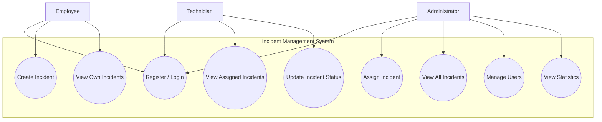

# Use Case Diagram

```mermaid
flowchart TB
    E[Employee]
    T[Technician]
    A[Administrator]
    subgraph SYS[Incident Management System]
      U1((Register / Login))
      U2((Create Incident))
      U3((View Own Incidents))
      U4((View Assigned Incidents))
      U5((Update Incident Status))
      U6((Assign Incident))
      U7((View All Incidents))
      U8((Manage Users))
      U9((View Statistics))
    end
    E --> U1
    E --> U2
    E --> U3
    T --> U1
    T --> U4
    T --> U5
    A --> U1
    A --> U6
    A --> U7
    A --> U8
    A --> U9
```
