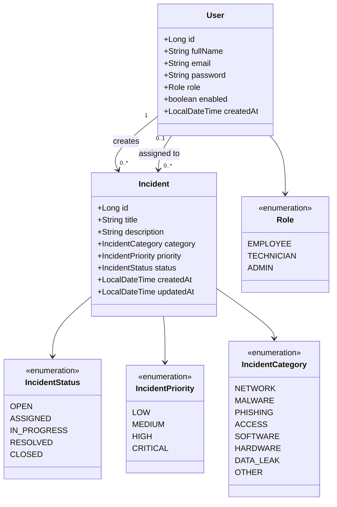

# Domain Class Diagram

```mermaid
classDiagram
    class User {
      +Long id
      +String fullName
      +String email
      +String password
      +Role role
      +boolean enabled
      +LocalDateTime createdAt
    }
    class Incident {
      +Long id
      +String title
      +String description
      +IncidentCategory category
      +IncidentPriority priority
      +IncidentStatus status
      +LocalDateTime createdAt
      +LocalDateTime updatedAt
    }
    class Role {
      <<enumeration>>
      EMPLOYEE
      TECHNICIAN
      ADMIN
    }
    class IncidentStatus {
      <<enumeration>>
      OPEN
      ASSIGNED
      IN_PROGRESS
      RESOLVED
      CLOSED
    }
    class IncidentPriority {
      <<enumeration>>
      LOW
      MEDIUM
      HIGH
      CRITICAL
    }
    class IncidentCategory {
      <<enumeration>>
      NETWORK
      MALWARE
      PHISHING
      ACCESS
      SOFTWARE
      HARDWARE
      DATA_LEAK
      OTHER
    }
    User "1" --> "0..*" Incident : creates
    User "0..1" --> "0..*" Incident : assigned to
    User --> Role
    Incident --> IncidentStatus
    Incident --> IncidentPriority
    Incident --> IncidentCategory
```
