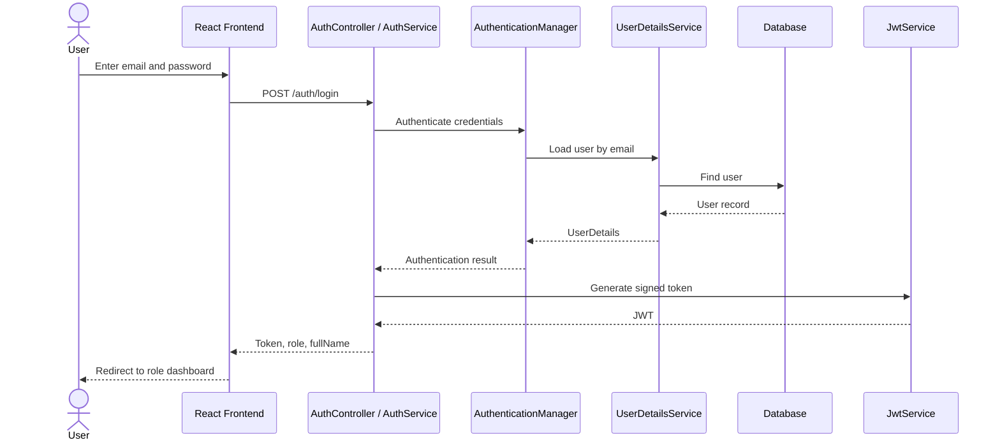

# Login Sequence Diagram

```mermaid
sequenceDiagram
    actor User
    participant UI as React Frontend
    participant Auth as AuthController / AuthService
    participant Manager as AuthenticationManager
    participant UDS as UserDetailsService
    participant DB as Database
    participant JWT as JwtService
    User->>UI: Enter email and password
    UI->>Auth: POST /auth/login
    Auth->>Manager: Authenticate credentials
    Manager->>UDS: Load user by email
    UDS->>DB: Find user
    DB-->>UDS: User record
    UDS-->>Manager: UserDetails
    Manager-->>Auth: Authentication result
    Auth->>JWT: Generate signed token
    JWT-->>Auth: JWT
    Auth-->>UI: Token, role, fullName
    UI-->>User: Redirect to role dashboard
```
