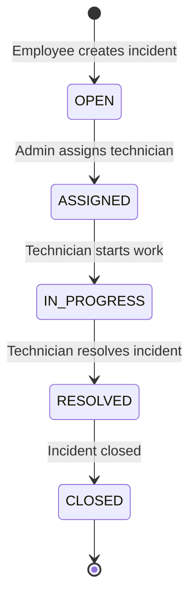

# Incident Lifecycle

```mermaid
stateDiagram-v2
    [*] --> OPEN: Employee creates incident
    OPEN --> ASSIGNED: Admin assigns technician
    ASSIGNED --> IN_PROGRESS: Technician starts work
    IN_PROGRESS --> RESOLVED: Technician resolves incident
    RESOLVED --> CLOSED: Incident closed
    CLOSED --> [*]
```

The backend treats a CLOSED incident as immutable.
