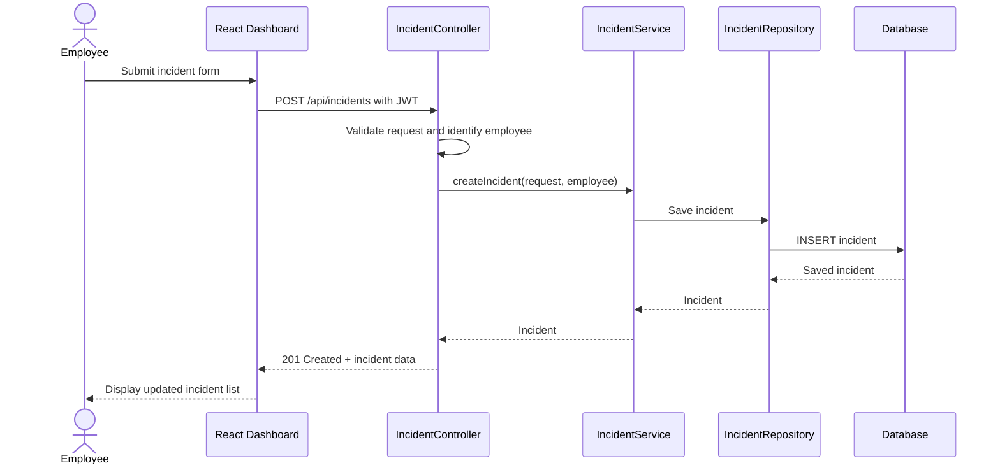

# Incident Creation Sequence

```mermaid
sequenceDiagram
    actor Employee
    participant UI as React Dashboard
    participant API as IncidentController
    participant Service as IncidentService
    participant Repo as IncidentRepository
    participant DB as Database
    Employee->>UI: Submit incident form
    UI->>API: POST /api/incidents with JWT
    API->>API: Validate request and identify employee
    API->>Service: createIncident(request, employee)
    Service->>Repo: Save incident
    Repo->>DB: INSERT incident
    DB-->>Repo: Saved incident
    Repo-->>Service: Incident
    Service-->>API: Incident
    API-->>UI: 201 Created + incident data
    UI-->>Employee: Display updated incident list
```
